# Schema Forge — Guide for SEO Managers

Schema Forge lets you build structured data (schema.org JSON-LD) visually and apply it across your site without writing code or asking a developer to extend Yoast SEO.

You work with two things:

- **Templates** — reusable schema definitions such as *Product*, *LocalBusiness*, *FAQPage* or *APIReference*. Values can be fixed text or **dynamic tokens** like `{{post.title}}` that are filled in from each page.
- **Assignments** — rules that decide which templates apply where: a whole post type, a category, a single post, the front page, an archive.

When Yoast SEO is active, your templates are merged into Yoast's schema graph (the WebSite / WebPage / Organization nodes Yoast already outputs), so search engines see one connected graph.

---

## 1. Where things live

Open **Schema** in the WordPress admin menu. You need the *Schema manager* capability, which administrators and Yoast SEO managers have by default.

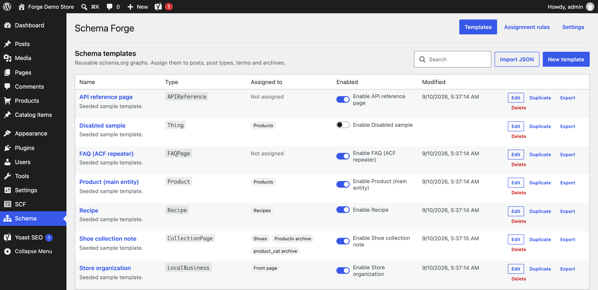

The **Templates** screen lists every template with its root type, where it is assigned, and an on/off switch. Disabled templates never render, even if assigned. From here you can **Edit**, **Duplicate**, **Export** (copies JSON to your clipboard) or **Delete** a template, and **Import JSON** shared by a colleague.

The other two tabs are **Assignment rules** (section 5) and **Settings** (section 8).

---

## 2. A tour of the builder

Open any template, for example *Product (main entity)*.

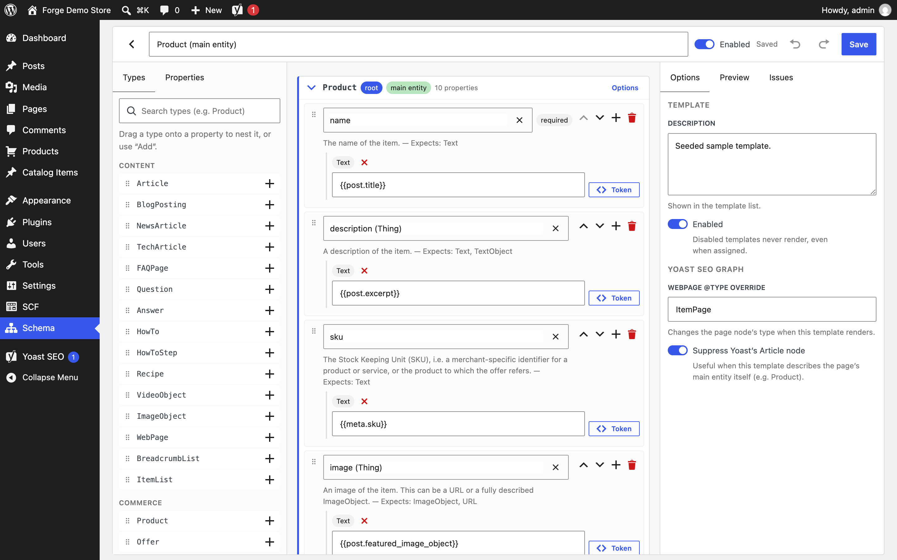

The builder has three areas:

1. **Palette (left)** — the full schema.org vocabulary. The *Types* tab lists common types by theme (Content, Commerce, Organizations & places, Technology & APIs) and a search box that finds any of the 900+ types. The *Properties* tab lists every property the selected node can have.
2. **Canvas (centre)** — your template as a tree. The root node is the main thing the template describes. Each property row has a name, one or more values, and buttons to reorder, add a value or remove it.
3. **Inspector (right)** — three tabs: **Options** for the selected node/property and the template itself, **Preview** to see the compiled JSON-LD for a real page, and **Issues** for validation.

The header has the template name, the enabled switch, undo/redo, and **Save** (⌘/Ctrl+S also saves).

### Searching the vocabulary

Type in the palette search to find any type. Searching "api" surfaces `APIReference` and `WebAPI`; deprecated schema.org terms are still available but marked *deprecated* with their replacement.

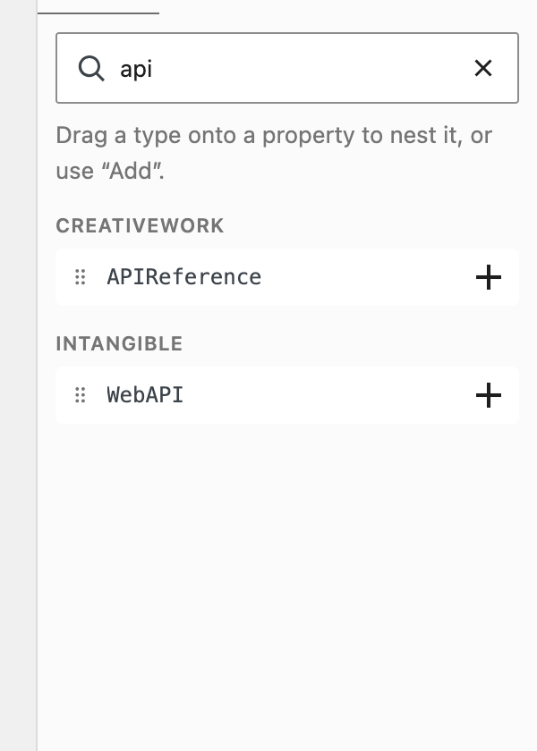

The *Properties* tab shows the properties of the selected node, including inherited ones (the grey label says which parent type they come from). Press **Add**, or drag one onto a node card.

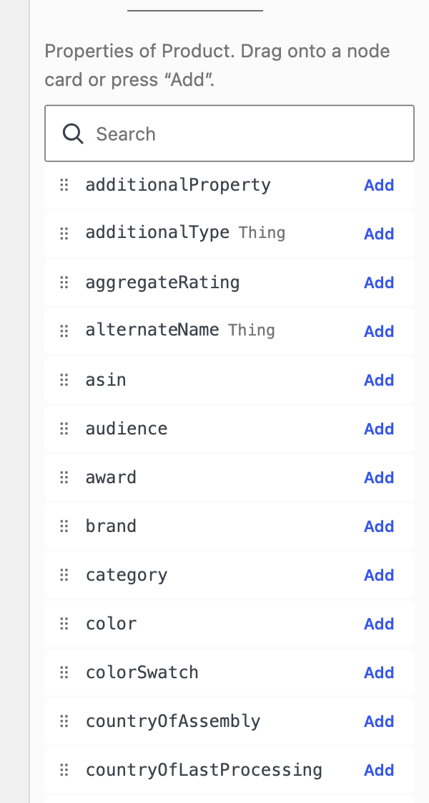

---

## 3. Tutorial: build a Product template

### Step 1 — Create the template and pick a root type

Click **New template**. Give it a name in the header, then choose the root type: drag a type from the palette onto the canvas, or search in the root type picker.

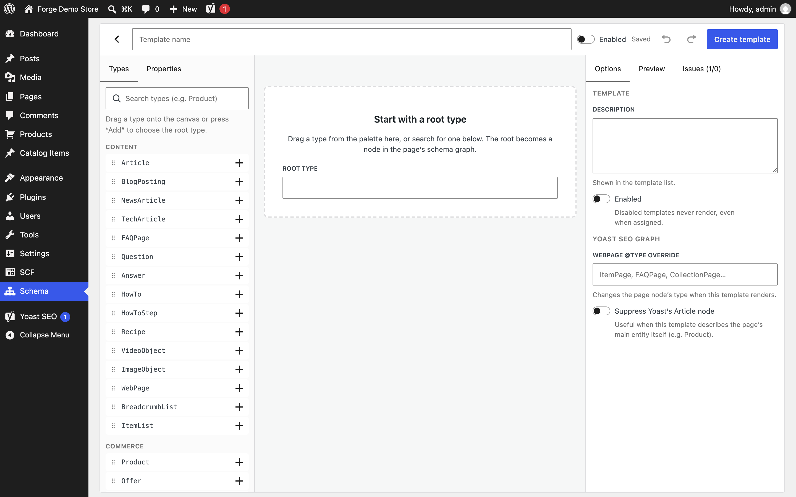

### Step 2 — Add properties

Click **Add property** on the node card and start typing (`name`, `description`, `sku`, `brand`, `offers`…). The picker only suggests properties that exist on the type, tells you what each expects, and lets you type a custom name if you need one.

Every new property starts with one **Text** value.

### Step 3 — Fill values with dynamic tokens

A value can be plain text (`https://schema.org/InStock`) or a token that is resolved from the page it renders on. Press **Token** next to any value to open the picker.

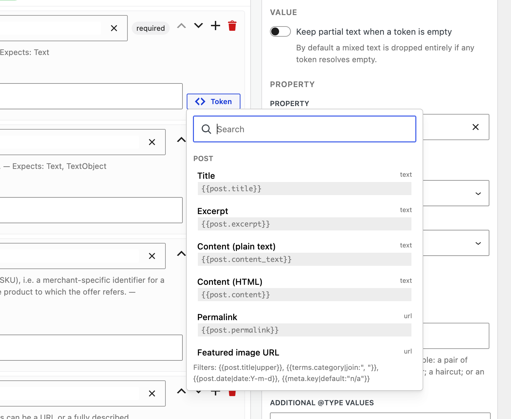

Common tokens:

| Token | Resolves to |
|---|---|
| `{{post.title}}`, `{{post.excerpt}}`, `{{post.content_text}}` | The post's title, excerpt, plain-text content |
| `{{post.permalink}}`, `{{post.date}}`, `{{post.modified}}` | URL and dates (ISO 8601) |
| `{{post.featured_image}}` / `{{post.featured_image_object}}` | Featured image URL, or a full ImageObject |
| `{{post.author.name}}`, `{{post.author.url}}` | Author details |
| `{{site.name}}`, `{{site.url}}`, `{{site.logo}}` | Site details |
| `{{meta.price}}`, `{{meta.sku}}` | Any custom field (post meta) by key |
| `{{acf.field_name}}` | Advanced Custom Fields values (images become ImageObjects, repeaters become lists) |
| `{{terms.category}}`, `{{terms.product_cat.first.name}}` | Taxonomy terms |
| `{{item.field}}` | The current row inside a *Repeat* value |

Tokens can be mixed with text (`{{post.title}} – {{site.name}}`) and take filters: `{{terms.category|join:", "}}`, `{{post.date|date:Y-m-d}}`, `{{post.title|upper}}`, `{{meta.stock|default:"0"}}`.

After you run a preview (step 6), each token shows its resolved value underneath the field, so you can see at a glance which fields are empty on that page.

### Step 4 — Nest objects, reference entities, repeat lists

Use the **+** on a property row to add a different kind of value:

- **Nested node** — an object inside the property, e.g. an `Offer` inside `offers`. Drag a type from the palette straight onto the property, or pick it in the slot that appears.
- **Reference (@id)** — point at an entity Yoast already outputs (site organization, person, author, primary image, breadcrumb), at another node in this template, or at another template's root.
- **Repeat over a list** — produce one node per item of a list token, e.g. one `Question` per row of an ACF repeater, using `{{item.question}}` inside.

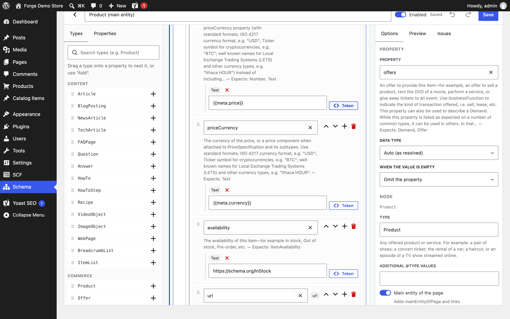

### Step 5 — Decide what happens when a value is empty

Select a property and open **Options**. *When the value is empty* controls the outcome on pages that lack the data:

- **Omit the property** (default) — the property is simply left out.
- **Use a fallback value** — e.g. `{{site.name}}` when a brand field is empty.
- **Required: drop the whole node** — if `name` is missing, don't output the node at all. Use this on properties Google requires so you never ship half-formed schema.

Set *Data type* when a value must be a number, boolean, URL or date. Number values such as `129.00` are output as numbers.

### Step 6 — Mark the main entity and adjust the page node

Select the root node. **Main entity of the page** links the page's WebPage node to your node (`mainEntity` / `mainEntityOfPage`), which is what search engines expect for Product, Recipe, Event and similar pages.

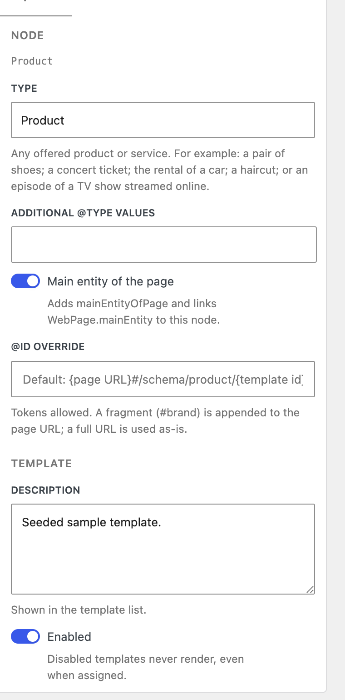

In the *Template* section further down you can also:

- override the page's `@type` (for example `ItemPage` for products, `FAQPage` for FAQ pages, `CollectionPage` for category-style pages);
- suppress Yoast's automatic *Article* node when your template already describes the page's main entity.

### Step 7 — Preview against a real page

Open the **Preview** tab, pick a post (or an archive kind) and read the compiled JSON-LD. It recompiles as you edit.

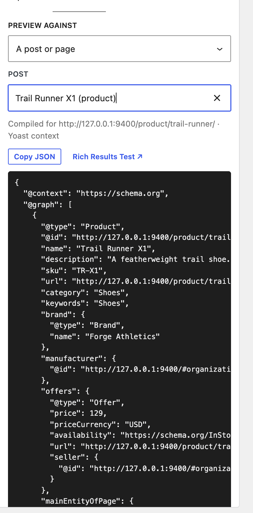

**Copy JSON** copies the output; **Rich Results Test** opens Google's validator for the previewed URL (the page must be publicly reachable).

### Step 8 — Check Issues and save

The **Issues** tab lists problems before you save: unknown types, properties not expected on the type, nested types that don't fit the property, required properties with no values, deprecated terms, empty references.

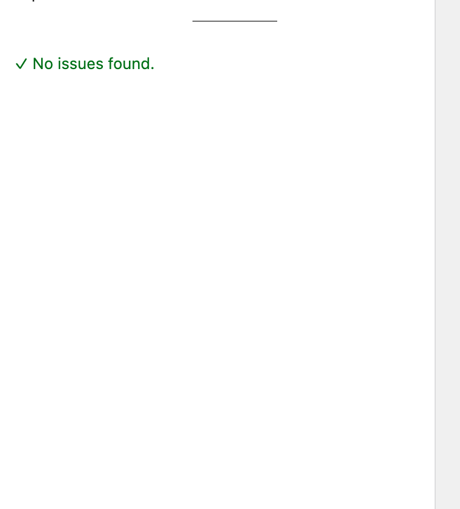

Errors block saving; warnings and info don't. Press **Save**. New templates are created *disabled* unless you switched **Enabled** on, so nothing changes on the live site until you're ready.

---

## 4. Templates for technical and API pages

The vocabulary includes everything schema.org publishes, including pending terms. For developer documentation use `APIReference` (properties `programmingModel`, `targetPlatform`, `assemblyVersion`, `executableLibraryName`, plus everything an `Article` has) and describe the service with a `WebAPI` node (`documentation`, `termsOfService`, `provider`). The sample *API reference page* template shows the pattern, including a `SearchAction` with the `query-input` property Google requires for site search boxes.

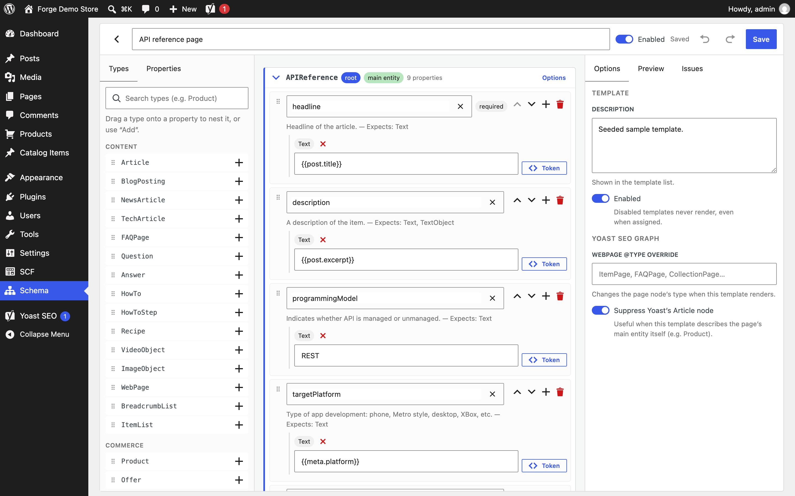

---

## 5. Assigning templates

Go to **Schema → Assignment rules**.

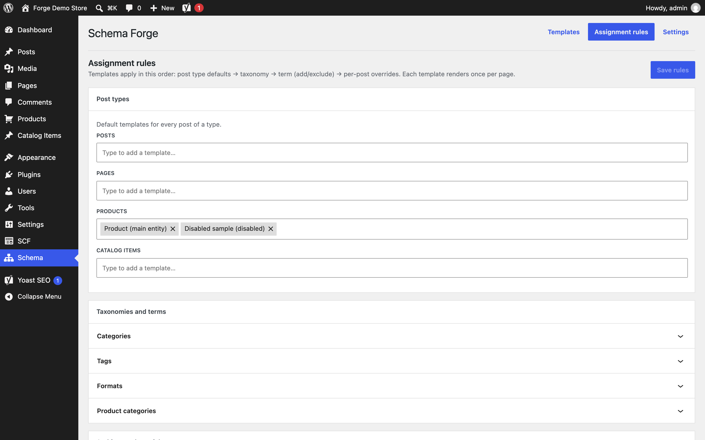

Templates are applied in this order, and each template renders once per page:

1. **Post type defaults** — every post of that type (e.g. all Products get *Product (main entity)*).
2. **Taxonomy** — every post that has any term in the taxonomy.
3. **Term rules** — for a specific term, *add* templates or *exclude* templates inherited from steps 1–2 (e.g. exclude the Product template for the "Gift cards" category).
4. **Per-post overrides** — set on the post itself (section 6).

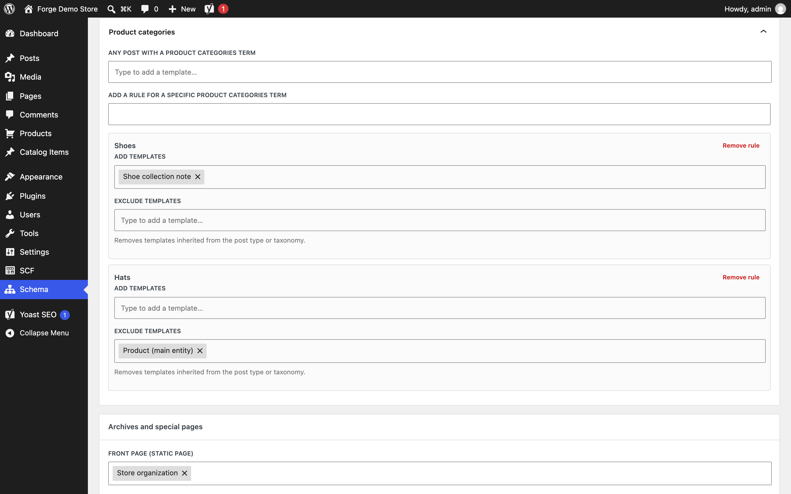

*Archives and special pages* covers the front page, blog index, search results, 404, author and date archives, plus post-type archives and taxonomy archives (with per-term overrides).

Press **Save rules** when done. The template list shows where each template is assigned.

---

## 6. Overriding on a single post

In the block editor, open the document settings sidebar and find **Schema templates**.

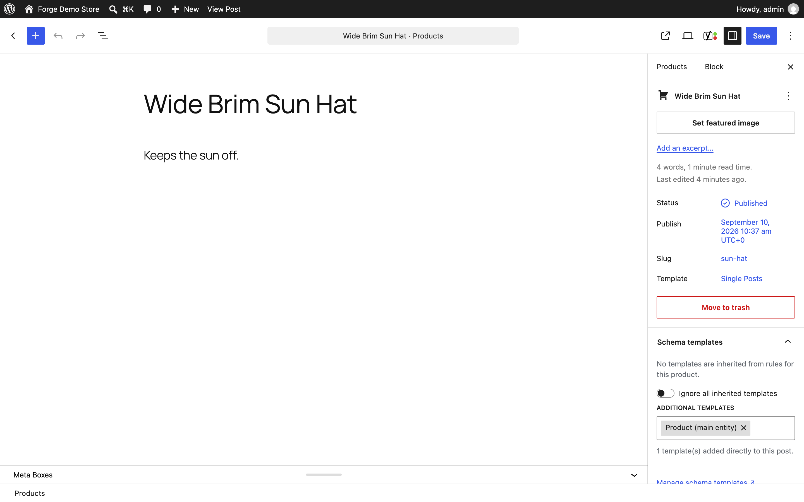

- Inherited templates are listed with the rule they came from; untick one to disable it on this post only.
- **Ignore all inherited templates** removes everything the rules would add.
- **Additional templates** attaches extra templates to this post.

Changes save immediately. The classic editor shows the same controls in a *Schema templates* box in the sidebar, saved with the post.

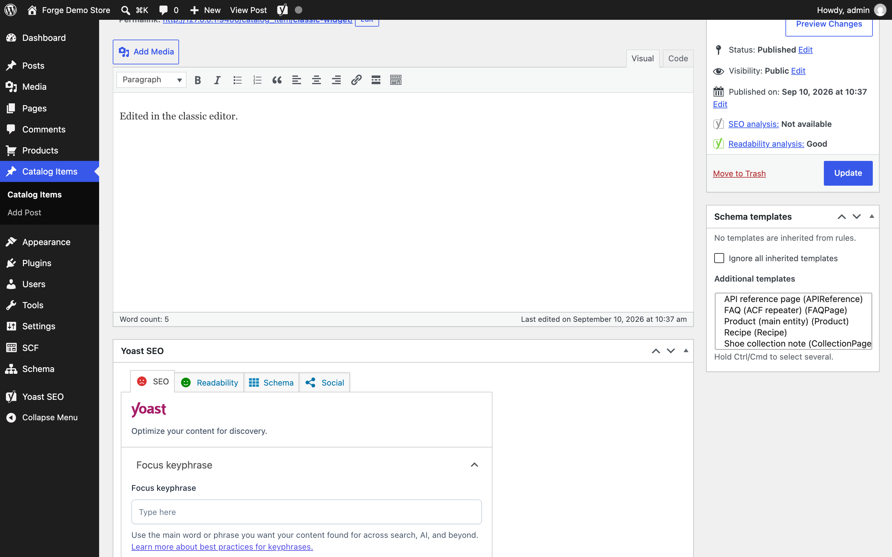

---

## 7. Checking the live output

View the source of a page and look for the `application/ld+json` script. With Yoast active your nodes appear inside Yoast's `@graph`; without Yoast, Schema Forge prints its own graph.

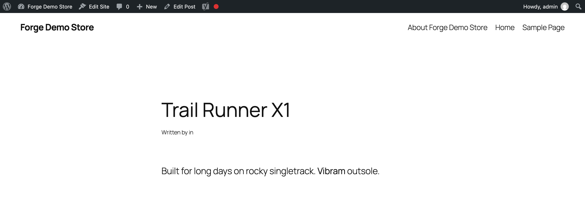

Paste the URL into [Google's Rich Results Test](https://search.google.com/test/rich-results) or the [Schema Markup Validator](https://validator.schema.org/) to confirm.

---

## 8. Settings

With Yoast active there is nothing to configure: the organization or person the site represents comes from *Yoast SEO → Settings → Site representation*. Without Yoast, choose whether the site represents an organization or a person so references such as *Site organization* resolve.

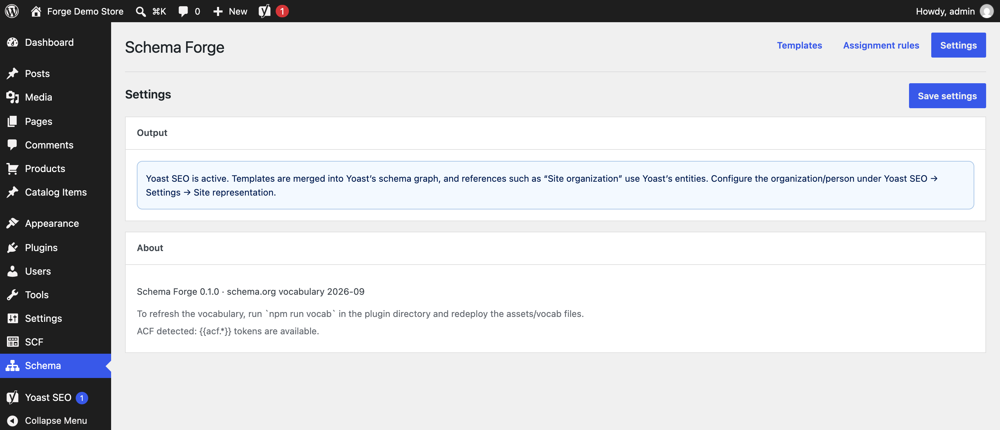

---

## 9. Tips and troubleshooting

- **The preview shows "No nodes produced".** A property marked *Required* resolved empty on that page. Check the resolved values under each field, add a fallback, or pick a different page.
- **A nested type shows a warning.** The property expects a different type (the hint says which). Warnings don't block output, but Google may ignore the value.
- **A template doesn't appear on a page.** Check it is *Enabled*, that a rule or the post's sidebar assigns it, and that no term rule excludes it. The sidebar on the post explains where each template comes from.
- **Deprecated terms.** Schema.org occasionally retires terms. They stay available (marked *deprecated*) so old templates keep working; the Issues tab names the replacement.
- **Sharing templates between sites.** Use *Export* on one site and *Import JSON* on the other. Imported templates arrive disabled.
- **Caching.** Output is generated on each page load; if you use a page cache, purge it after changing templates or rules.
